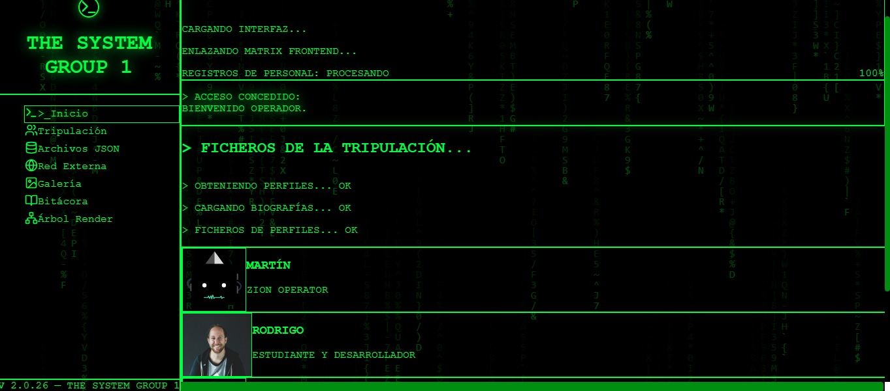
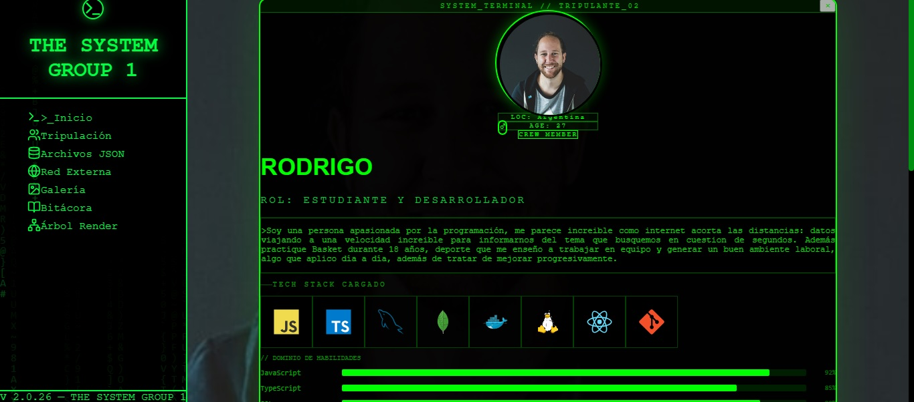
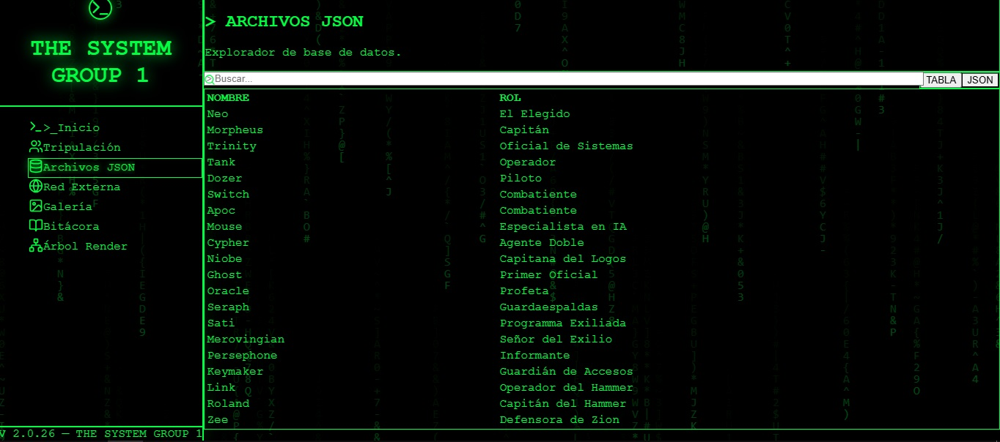
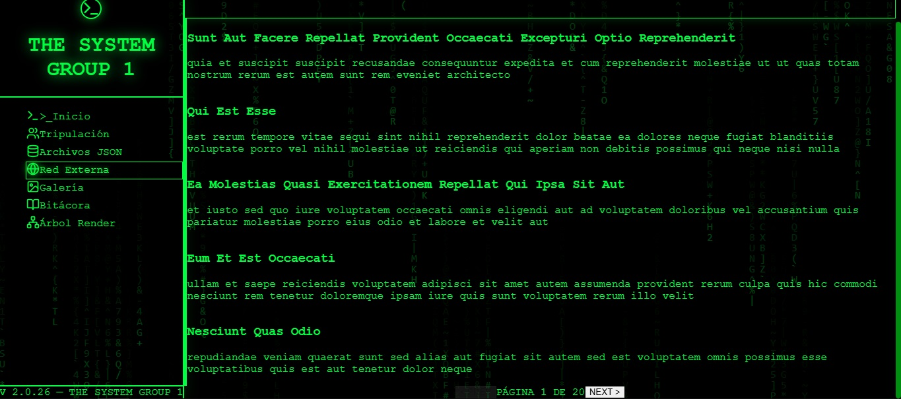
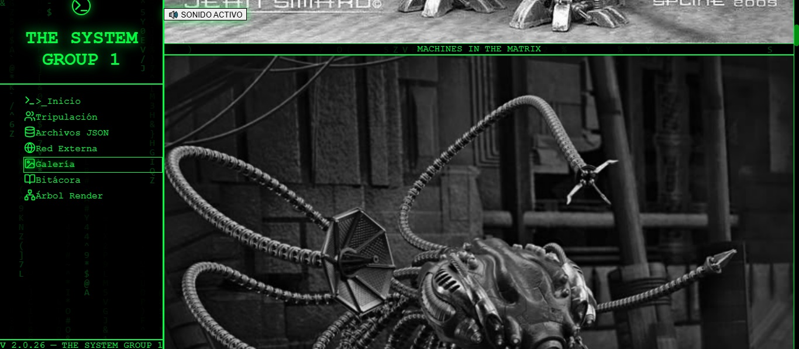
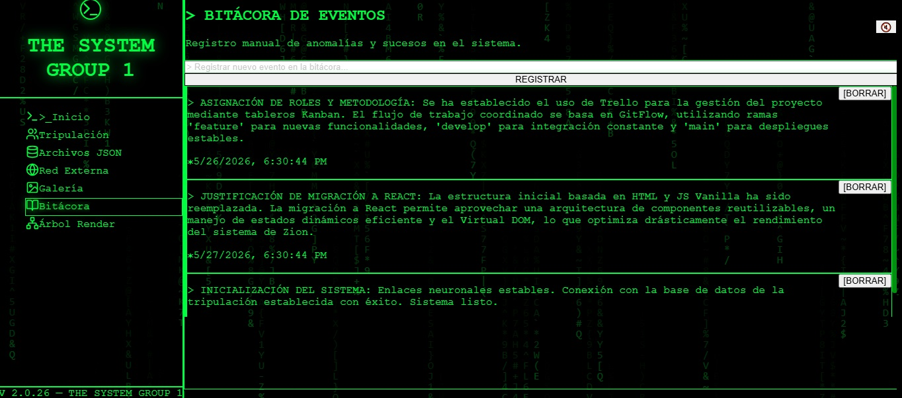

# 💻 THE MATRIX - THE SYSTEM - GRUPO 1

🔗 **Link de Vercel:** (https://matrix-frontend-tp2.vercel.app/)

## 📖 Descripción del Proyecto

Este proyecto es la interfaz frontend del sistema "The Matrix" para el Trabajo Práctico Grupal 2 (TP2). Se trata de un panel de control interactivo estilo dashboard inspirado en la estética cyberpunk de la película The Matrix, donde los operadores de Zion pueden acceder a expedientes clasificados, visualización de datos de la red y registros del sistema.

La aplicación migra completamente la estructura del TP1 (HTML, CSS y JS Vanilla) hacia una arquitectura de componentes en React, utilizando Vite como bundler y Tailwind CSS para los estilos. Incluye navegación SPA con React Router, consumo de API externa, manejo de datos locales en JSON, galería interactiva y perfiles individuales con barras de habilidades animadas y carrusel de proyectos.

---

## 👥 Integrantes de la Tripulación

- **Martín** - [GitHub](https://github.com/fguzman3026)
- **Rodrigo Zocco** - [GitHub](https://github.com/RodrigoZocco)
- **Facundo** - [GitHub](https://github.com/fazcue)
- **Florencia** - [GitHub](https://github.com/juliomorales-cell)

---

## 🛠️ Tecnologías Utilizadas

- **React 19** (con Hooks: `useState`, `useEffect`, `useMemo`, `useRef`)
- **React Router DOM v6** (navegación SPA)
- **Vite** (bundler ultrarrápido)
- **Tailwind CSS** (utility-first framework)
- **Lucide React** (iconografía principal para menú y navegación)
- **React Icons** (íconos de redes sociales: GitHub, LinkedIn, Twitter)
- **Google Fonts** (tipografía monospace de sistema)
- **APIs externas**: JSONPlaceholder (https://jsonplaceholder.typicode.com/posts)
- **Devicon** (logos de tecnologías en los perfiles)

---

## 📂 Estructura de Archivos

```text
matrix-frontend/
├── public/                 # Assets estáticos (imágenes, audios)
│   ├── img/                # Imágenes para carrusel de proyectos
│   ├── Habitacion-Martin.png
│   ├── trip-martin.jpg
│   ├── trip-rodrigo.jpg
│   ├── trip-facundo.jpg
│   ├── trip-florencia.jpg
│   ├── llamada.mp3
│   ├── tono.mp3
│   └── seleccion-tripulante.mp3
├── src/
│   ├── components/         # Componentes modulares
│   │   ├── ArbolRender.jsx
│   │   ├── Bitacora.jsx
│   │   ├── MatrixGallery.jsx
│   │   ├── MatrixRain.jsx
│   │   ├── PerfilBase.jsx   # Componente plantilla para perfiles
│   │   ├── PerfilFacundo.jsx
│   │   ├── PerfilFlorencia.jsx
│   │   ├── PerfilMartin.jsx
│   │   └── PerfilRodrigo.jsx
│   ├── data/               # Base de datos local
│   │   ├── registros.json
│   │   └── tripulantes.json
│   ├── App.jsx             # Enrutador principal, Sidebar, Home, Tripulación, JSON, API
│   ├── index.css           # Estilos base y configuración de Tailwind
│   └── main.jsx            # Punto de entrada de React
├── package.json
├── tailwind.config.js
├── vite.config.js
└── README.md
```

---

## 🎨 Guía de Estilos

El diseño visual está completamente inspirado en la estética cyberpunk de "The Matrix", con una paleta monocromática de verdes fosforescentes sobre fondos negros profundos.

### Paleta de Colores

| Uso                          | Código HEX         | Clase Tailwind            |
| ---------------------------- | ------------------ | ------------------------- |
| Verde neón principal         | `#00FF41`          | `green-500` personalizado |
| Verde oscuro secundario      | `#007F20`          | `green-700`               |
| Verde muy oscuro (bordes)    | `#14532D`          | `green-900`               |
| Fondo negro puro             | `#000000`          | `black`                   |
| Fondo negro semitransparente | `rgba(0,0,0,0.85)` | `bg-black/85`             |
| Fondo de terminal            | `rgba(0,0,0,0.95)` | `bg-black/95`             |

### Tipografía

- **Principal**: Monospace de sistema (`font-mono` en Tailwind)
- **Efectos**: `tracking-widest`, `uppercase` para títulos; `drop-shadow` con glow verde para jerarquía visual.
- **Google Fonts**: No se importó una fuente externa para mantener la estética de consola retro. Se usa la monoespaciada por defecto del sistema (Consolas, Courier New, monospace).

### Iconografía

- **Navegación y UI**: `lucide-react` (Terminal, Users, Database, Globe, Image, BookOpen, Search, Network)
- **Redes Sociales**: `react-icons/fa` (FaGithub, FaLinkedin, FaTwitter)
- **Tecnologías**: SVGs de [Devicon](https://devicon.dev/) (html5, css3, javascript, react, nodejs, python, mysql, mongodb, docker, git, etc.)

---

## ⚙️ Funciones Dinámicas Implementadas en React

### 1. Secuencia de conexión animada (`Home`)

- **Hooks**: `useState`, `useEffect`, `useRef`
- Controla una simulación de carga con barra de progreso que avanza aleatoriamente hasta el 99%.
- Reproduce audio secuencial: "llamada.mp3" → "tono.mp3" al completar.
- Al finalizar (`fase === 2`), revela la grilla de tripulantes con animación `fadeIn`.
- Las tarjetas son componentes `Link` que redirigen a `/integrantes/:id`.

### 2. Barras de progreso animadas (`PerfilBase`)

- **Hooks**: `useState`, `useEffect`
- Cada habilidad arranca con `width: 0%` y mediante un `setTimeout` de 400ms se setea al valor real (75-95%).
- La transición dura 1s (`transition-all duration-1000 ease-out`) con efecto de gradiente y sombra neón.
- Los porcentajes se renderizan dinámicamente en tiempo real.

### 3. Carrusel de proyectos (`PerfilBase`)

- **Hook**: `useState` para índice actual.
- Navegación cíclica: botones ◀ y ▶ con `setIndice` que respetan límites y reinician al principio/fin.
- Contador visual de posición (`1/3`, `2/3`, etc.).
- Las imágenes se obtienen de `tripulante.proyectos` o de placeholders por defecto.

### 4. Filtro en tiempo real del Explorador JSON (`ArchivosJSON`)

- **Hook**: `useMemo`
- El filtrado se recalcula solo cuando cambia el string de búsqueda, evitando renders innecesarios.
- Búsqueda insensible a mayúsculas sobre `nombre` y `rol`.
- Vista conmutable entre tabla HTML y salida cruda JSON (`<pre>`).

### 5. Consumo de API externa con paginación (`RedExterna`)

- **Hooks**: `useState`, `useEffect`
- Maneja tres estados: **loading** (spinner verde), **error** (alerta roja con diseño cyberpunk), **éxito** (posts paginados).
- Fetch a `https://jsonplaceholder.typicode.com/posts`.
- Paginación manual de 5 posts por página con botones PREV/NEXT deshabilitados en extremos.
- Indicador de página actual (`PÁGINA X DE Y`).

### 6. Galería con Lightbox (`MatrixGallery`)

- Navegación por teclado: flechas izquierda/derecha para cambiar imagen, tecla ESC para cerrar.
- Zoom interactivo en la imagen abierta.
- Audio ambiental con control de volumen neón.

### 7. Bitácora interactiva (`Bitacora`)

- **Hook**: `useState` para almacenar registros.
- Funcionalidad de agregar y eliminar registros en tiempo real sobre el estado local.
- Intro cinematográfica con audio y animación de fallas del sistema.

---

## 📸 Capturas de Pantalla

### Home



### Perfil individual



### Explorador JSON



### Red externa con paginación



### Galería con Ligthbox



### Bitácora



### Árbol de renderizado


---

## 🚀 Evolución del Proyecto (Migración a React)

El proyecto inicial (TP1) fue desarrollado con HTML5, CSS3 y JavaScript Vanilla. La migración a **React** representó los siguientes avances técnicos:

| Aspecto             | TP1 (Estático)           | TP2 (React)                                                           |
| ------------------- | ------------------------ | --------------------------------------------------------------------- |
| **Renderizado**     | Recarga completa del DOM | Virtual DOM con renderizado eficiente                                 |
| **Navegación**      | Múltiples archivos .html | SPA con React Router DOM                                              |
| **Componentes**     | Código repetitivo        | Componentes reutilizables (`PerfilBase`, `NavItem`, `BarrasProgreso`) |
| **Estado**          | Variables globales en JS | `useState`, `useEffect`, `useMemo`                                    |
| **Datos dinámicos** | Estáticos en HTML        | Carga asíncrona desde API y JSON local                                |
| **Mantenibilidad**  | Difícil de escalar       | Arquitectura modular con carpeta `/components`                        |

**Mejoras específicas implementadas:**

- **Animaciones de carga** con barra de progreso y secuencia de audio en el Home.
- **Barras de habilidades animadas** en cada perfil, con transiciones suaves de 0 al porcentaje real.
- **Carrusel de proyectos** interactivo en cada tripulante.
- **Efectos hover avanzados** en redes sociales (escala, sombra neón) y en tarjetas de la tripulación.
- **Lightbox** en la galería con navegación por teclado y audio ambiental.
- **Bitácora** con agregado/eliminación de registros en tiempo real.

**Conclusón:**
- Creemos que React favorece la reutilización de componentes, facilita el agregado de "lógica" y vuelve mas facil de escribir y mantener proyectos que pueden volverse complejos. La forma de crear componentes por separado es muy buena para centrarnos en lo que estamos trabajando y abstraernos de todo lo otro para corregir hasta los detalles más chicos en proyectos gigantes.
---

## 🧠 Uso de Inteligencia Artificial

Durante el desarrollo de esta entrega se utilizaron las siguientes herramientas de IA de manera responsable, manteniendo siempre la autoría y el control sobre el código final:

### Herramientas Utilizadas

**DeepSeek**: Asistente principal para la auditoría técnica del proyecto, debugging de estilos CSS/Tailwind, refactorización de componentes React y corrección de errores visuales. Se utilizó como revisor de código y guía para cumplir con los requerimientos de la rúbrica del TP2.

- **Gemini Pro 3.1** (Google AI Studio): Utilizado para la generación de contenido creativo, como las biografías de los tripulantes y los prompts para la creación de imágenes temáticas

### Uso en Contenido y Código

- **Auditoría de requisitos**: Se solicitó a la IA una revisión exhaustiva del repositorio frente a la rúbrica del TP2, obteniendo una matriz de cumplimiento detallada que guió las correcciones finales.
- **Debugging de estilos**: La IA ayudó a detectar problemas visuales (barras de progreso invisibles, íconos con color incorrecto, padding insuficiente) y propuso soluciones con estilos inline garantizados.
- **Refactorización de componentes**: Se recibieron sugerencias para modularizar `PerfilBase` con subcomponentes (`BarrasProgreso`, `CarruselProyectos`, `RedesSociales`), lo que permitió reutilizar código entre los cuatro perfiles.
- **Generación de textos**: Las biografías de los tripulantes (Martín, Rodrigo, Facundo, Florencia) fueron redactadas con asistencia de IA, luego revisadas y ajustadas por el equipo.

### Imágenes Generadas con IA

- **Modelo**: Gemini Imagen 3 (Google AI Studio)
- **Prompt utilizado para "Habitacion-Martin.png"**:
  Genera una habitación cyberpunk estilo Matrix, con tonos verdes neón y negros profundos.
  Una cama tecnológica con cables de datos, ventanas que muestran código lloviendo,
  pantallas holográficas flotantes, y una iluminación ambiental verde oscuro.
  Estilo realista, 4K, atmosfera opresiva pero futurista.
- **Avatares**: Generados con la API de DiceBear (estilo bottts) usando seeds personalizados para cada integrante y colores verde/negro.
- **Fondos adicionales**: Si se utilizaron otras imágenes generadas por IA para los perfiles, detallar aquí los prompts correspondientes.

---

## 📦 Instalación y Uso Local

1. Clonar el repositorio:

(https://github.com/juliomorales-cell/matrix-frontend-tp2.git)

2. Instalar dependencias: `npm install`

3. Correr el proyecto: `npm run dev`
